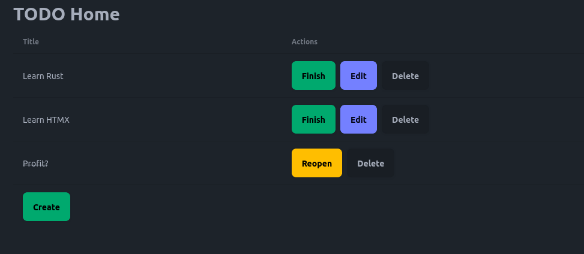

# Rust + HTMX Template

Full list of technologies used:

- Rust + HTMX
- `axum`: HTTP framework
- `rusqlite` + `sea_query` + `serde_rusqlite`: database accessing
- `refinery`: database migration
- Askama: HTML templating
- `dotenvy`: loading environment variables
- `snafu`: error handling
- Tailwind CSS (with DaisyUI): styling
- `just` + `watchexec`: development server starting

## Screenshot



## Development

### Prerequisites

- Make sure that you have `rustc` and `cargo` installed (ideally by
  using [rustup](https://rustup.rs/)).
- For database migration, you should have `refinery` available (`cargo 
  install refinery_cli`).
- For Tailwind CSS and DaisyUI, you should have `tailwindcss-extra` available
  (the binary can be downloaded
  [here](https://github.com/dobicinaitis/tailwind-cli-extra/releases/)).
- You should also have `watchexec` and `just` installed (`cargo install 
  watchexec`, and `cargo install just`).

### Starting the development server

- Run everything:

```shell
just
```

The server will be available at `http://localhost:3000`.

### Migrations

TBA

### Favicon

- Generate favicons from https://favicon.io/favicon-converter/, then place them
  in `static` folder.

## Project Structure

- `src/`: contains the source code of the project
- `static/`: contains static files which are served from the root path (for
  example, `static/styles.css` will be accessed at
  `http://localhost:3000/styles.css`)
- `migrations/`: contains database migration files